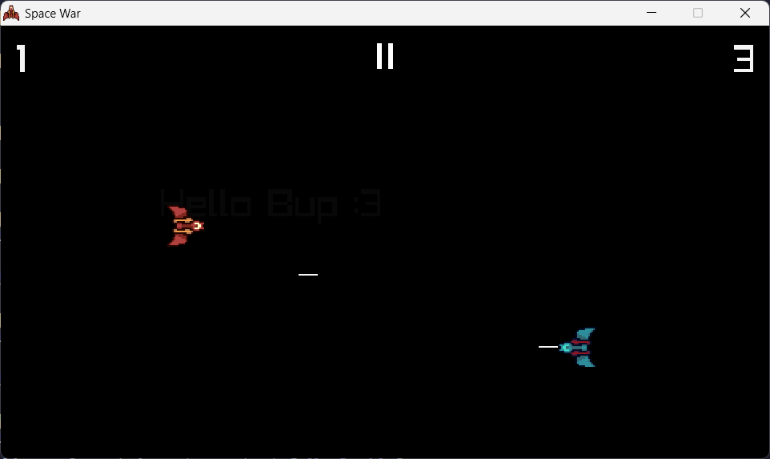
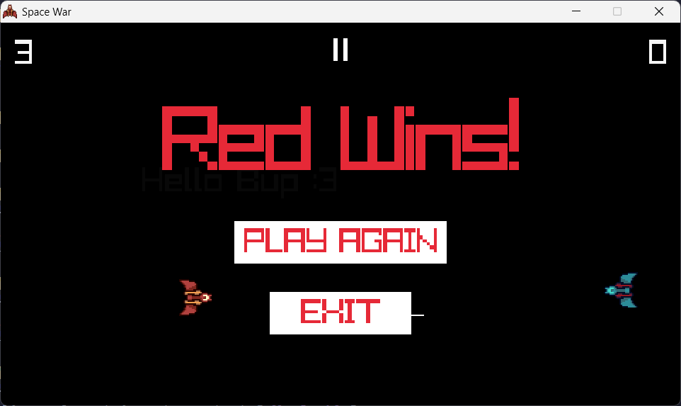

# 🚀 SPACEWAR

**SPACEWAR is a local 2 player spaceship shooting game!**

SPACEWAR is written in C with cool game library: [Raylib](https://www.raylib.com/).

## 🖼️  Images





## 👷🏻 Building

Raylib files in this project is for Windows. So, if you building in Unix,
make sure to have Raylib installed.

### Windows

```powershell
gcc main.c -o spacewar.exe -O3 -Iinclude -Llib -lraylib -lopengl32 -lgdi32 -lwinmm
```

### Linux

```bash
gcc main.c -o spacewar -O3 -lraylib
```

## ⌨️ Controls

- W/A/S/D to **move** left spaceship
- SPACE to **shoot** for left spaceship
- ARROW KEYS UP/LEFT/DOWN/RIGHT to **move** right spaceship
- COMMA to **shoot** for right spaceship
- ESC to **pause** game
- F11 to toggle fullscreen mode

## 📝 Todo

- [x] Make window resizable
- [ ] Make game update follows delta time
- [ ] Add button click sound effect
- [ ] Add button on hover effect
